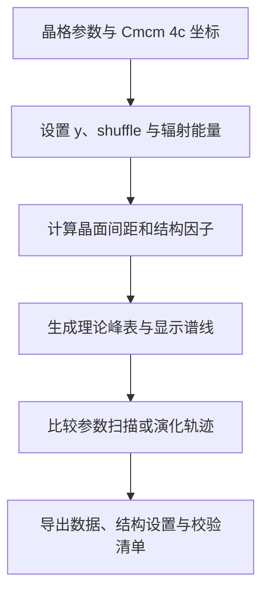

# CrystalShift XRD

**改变 Cmcm 4c 晶格、Wyckoff 坐标和辐射条件，比较理论粉末衍射峰位与结构因子。**

A Streamlit workbench for studying how lattice parameters, Wyckoff `y`, basal shuffle, and X-ray energy affect theoretical powder diffraction. Useful for testing structural sensitivity before interpreting a measured pattern.

[结构约定](#model-contract) · [安装与运行](#install--quick-start) · [使用与导出](#usage) · [模型与设计资料](docs/)

[](LICENSE) [](pyproject.toml)



**从单个结构开始。** 安装后启动 `streamlit run app.py --server.port 8508`，先检查下方四个原子坐标，再一次改变一个参数。理论峰位与强度变化不等于已确定实验相变机制。

包版本 `2.3.0`，导出 schema `2.4`。仓库名 `Ortho_shuflle` 保留历史拼写，Python 包仍为 `orthorhombic-xrd-simulator`。

## Model contract

```text
(0, y, 1/4), (0, -y, 3/4),
(1/2, 1/2+y, 1/4), (1/2, 1/2-y, 3/4)

shuffle_signed     = 2*(y-0.25)
shuffle_magnitude  = |shuffle_signed|
normalized_shuffle = shuffle_magnitude / 0.5   # in [0, 1]
wavelength_A   = 12.398419843320026 / energy_keV
I_model_peak   = F² × applied_multiplicity × applied_LP × applied_volume_factor × line_weight
applied_volume_factor = 1 / V_cell when the cell-volume correction is enabled; otherwise 1
```

`R_hkl` with/without LP is for experimental area post-processing (theoretical only).

## Install / Quick start

```powershell
py -3.11 -m venv .venv
.\.venv\Scripts\Activate.ps1
python -m pip install -e ".[dev]"
python -m streamlit run app.py --server.port 8508
```

Open http://localhost:8508/  
Windows launcher: `启动 CrystalShift XRD.bat`

## Usage

<p align="center">
  
</p>

- **Pattern** — static 2θ / *q* / *d*
- **Live evolution** — exact precomputed frames; browser switches locally
- **F² evolution** + structure preview along `b`
- **Sweep / trajectory** CSV · **discrete-peak fit** diagnostics
- Schema 2.4 ZIP + `analysis.xlsx` with hashes and checksums

## Scientific boundary — what it is NOT

Does **not** implement Rietveld / Le Bail / Pawley, texture, absorption, size/strain broadening, zero shift, background, phase fractions, or absolute intensity calibration.

## Tests

```bash
python -m pytest -q && python -m ruff check .
```

## License

MIT — see [`LICENSE`](LICENSE). Cite the structure source and keep export manifests with figures.
