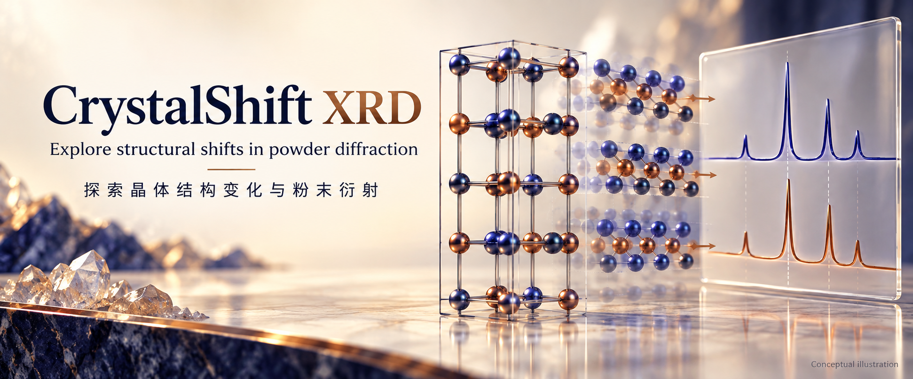

<p align="center">
  
</p>

# CrystalShift XRD

**Explore how Cmcm structural parameters change powder diffraction**

**探索 Cmcm 结构参数对粉末衍射的影响**

[Overview / 项目概览](#overview--项目概览) · [Start / 开始使用](#start--开始使用) · [Reference / 详细说明](#reference--详细说明)

## Overview / 项目概览

Use a theoretical powder-diffraction workbench to vary lattice parameters, the Wyckoff y coordinate, shuffle and X-ray energy. Compare peak shifts and structure-factor changes across sweeps.

在理论粉末衍射工作台中改变晶格参数、Wyckoff y 坐标、原子微移与 X 射线能量，比较参数扫描中的峰位和结构因子变化。

- **Structure exploration** — 围绕明确的 Cmcm 4c 坐标约定分析。
- **Patterns and trajectories** — 检查静态谱、演化序列与参数轨迹。
- **Traceable export** — 保存数据表、结构设置与校验信息。

## Start / 开始使用

```powershell
py -3.11 -m pip install -e ".[dev]"
py -3.11 -m streamlit run app.py --server.port 8508
```

The model explores theoretical diffraction; it does not perform Rietveld refinement or absolute-intensity calibration.

本模型探索理论衍射，不执行 Rietveld 精修或绝对强度标定。

*Cover: AI-generated conceptual illustration. 封面为 AI 生成的概念插图。*

## Reference / 详细说明

# CrystalShift XRD

**How lattice, Wyckoff `y`, basal shuffle, and energy move powder peaks and F².**

[](LICENSE)
[](https://www.python.org/downloads/)
[](pyproject.toml)

Streamlit workbench for theoretical powder XRD of orthorhombic **`Cmcm 4c`**. Package version `2.3.0` · export schema `2.4`.

> Repository folder name `Ortho_shuflle` keeps the historical typo — do not rename the remote.

> Theoretical model only — not Rietveld, not absolute intensity calibration.

<p align="center">
  
</p>

## Model contract

```text
(0, y, 1/4), (0, -y, 3/4),
(1/2, 1/2+y, 1/4), (1/2, 1/2-y, 3/4)

shuffle_signed     = 2*(y-0.25)
shuffle_magnitude  = |shuffle_signed|
normalized_shuffle = shuffle_magnitude / 0.5   # in [0, 1]
wavelength_A   = 12.398419843320026 / energy_keV
I_model_peak   = F² × applied_multiplicity × applied_LP × applied_volume_factor × line_weight
applied_volume_factor = 1 / V_cell when the cell-volume correction is enabled; otherwise 1
```

`R_hkl` with/without LP is for experimental area post-processing (theoretical only).

## Install / Quick start

```powershell
py -3.11 -m venv .venv
.\.venv\Scripts\Activate.ps1
python -m pip install -e ".[dev]"
python -m streamlit run app.py --server.port 8508
```

Open http://localhost:8508/  
Windows launcher: `启动 CrystalShift XRD.bat`

## Usage

<p align="center">
  
</p>

- **Pattern** — static 2θ / *q* / *d*
- **Live evolution** — exact precomputed frames; browser switches locally
- **F² evolution** + structure preview along `b`
- **Sweep / trajectory** CSV · **discrete-peak fit** diagnostics
- Schema 2.4 ZIP + `analysis.xlsx` with hashes and checksums

## Scientific boundary — what it is NOT

Does **not** implement Rietveld / Le Bail / Pawley, texture, absorption, size/strain broadening, zero shift, background, phase fractions, or absolute intensity calibration.

## Tests

```bash
python -m pytest -q && python -m ruff check .
```

## License

MIT — see [`LICENSE`](LICENSE). Cite the structure source and keep export manifests with figures.
